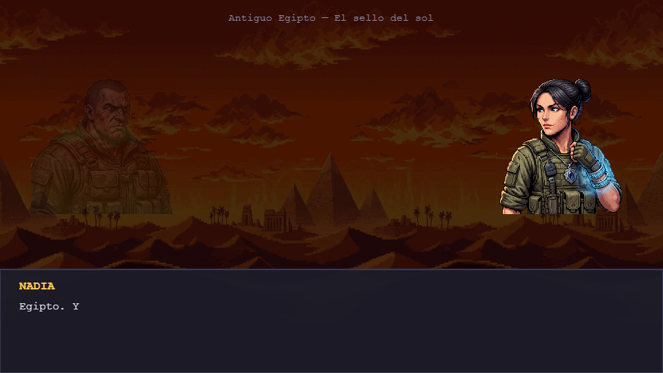
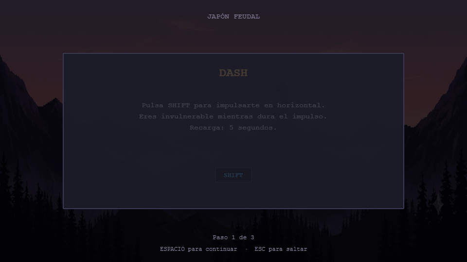
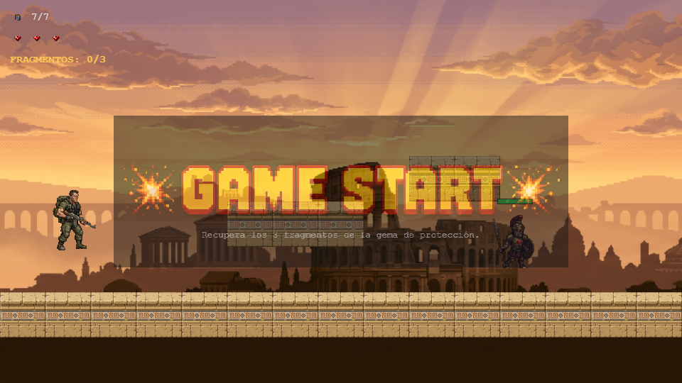
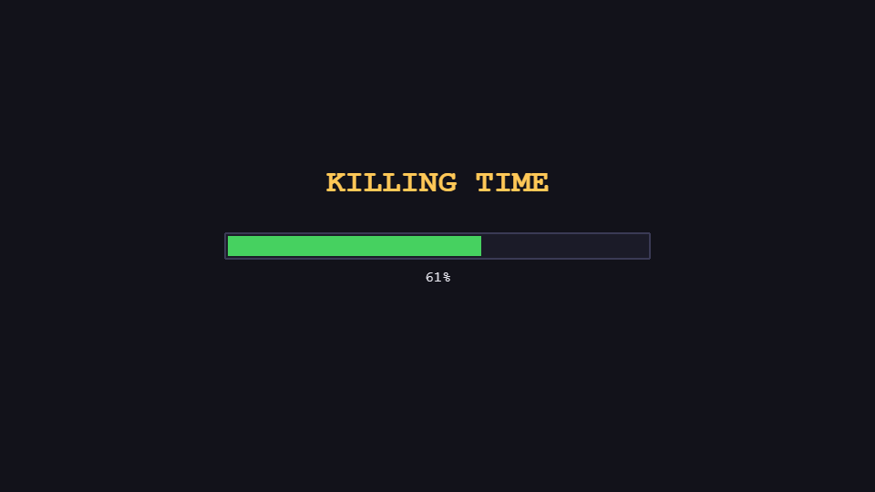
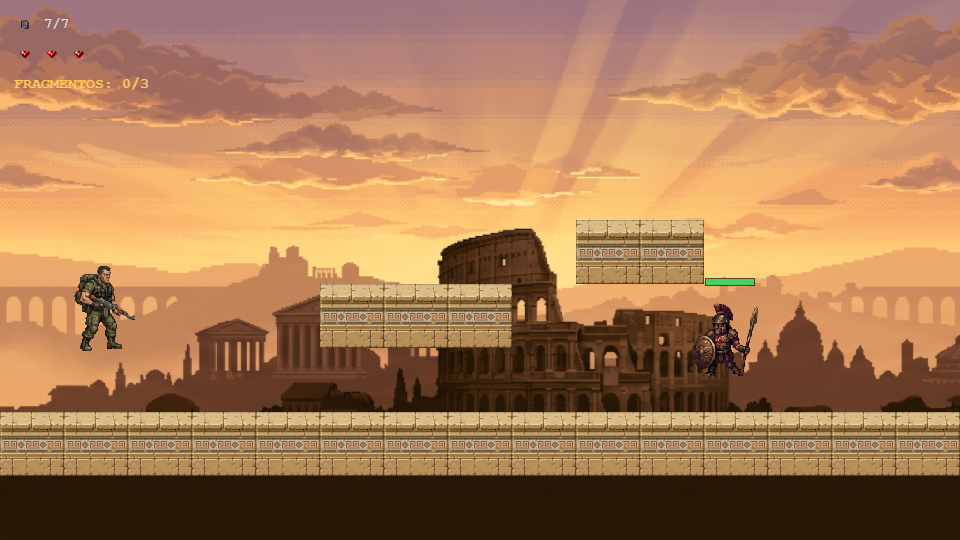
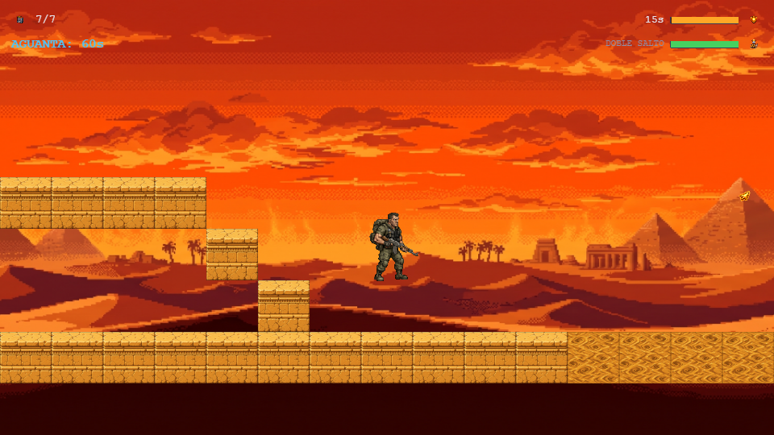
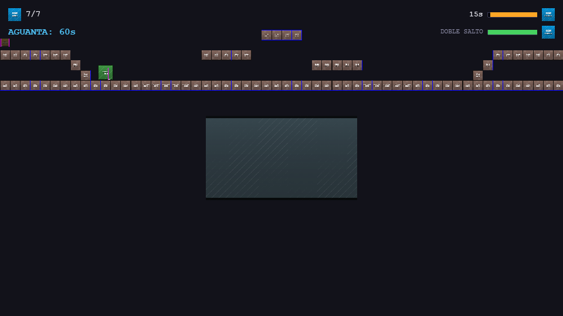
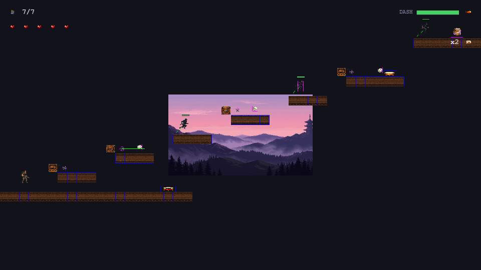

# Killing Time

Juego 2D plataformero-shooter en Phaser 3, ambientado en 4 épocas históricas.
Drago, un soldado, atraviesa portales temporales para recuperar las gemas de
protección que el coronel Viktor Kaelen fracturó con el dispositivo KT, guiado
por radio por Nadia.

Entregable académico. La especificación funcional está en
`prompt-implementacion-juego-phaser.md` y la de arte en
`prompts-assets-graficos.md`.

---

## Capturas

Todas están tomadas del juego en ejecución, con los assets gráficos definitivos
integrados (71 de 78; los 7 que faltan siguen como placeholder procedural y ninguno
se usa en el código).

| | |
|---|---|
| **Menú principal**<br> | **Selector de escenario**<br> |
| **Diálogo Drago–Nadia**<br> | **Tutorial por nivel**<br> |
| **Banner GAME START**<br> | **Juego y HUD completo**<br> |
| **Cajas de colisión (`?debug=1`)**<br> | **Pantalla de carga**<br> |
| **Nivel 1 — Antigua Roma**<br> | **Trazado completo del nivel 1**<br> |
| **Nivel 2 — Antiguo Egipto**<br> | **Trazado completo del nivel 2**<br> |
| **Nivel 3 — Japón Feudal**<br> | **Trazado completo del nivel 3**<br> |
| **Nivel 4 — Fortaleza Medieval**<br> | **Trazado completo del nivel 4**<br> |

Las capturas 06 y 07 son de `SandboxScene`, la escena de pruebas: pide todos los
widgets del HUD a la vez para poder revisarlos de una pasada, cosa que ningún
nivel real hace.

Las vistas de "trazado completo" son cada nivel entero con `?zoom=…&debug=1`, útiles
para revisar el diseño de un mapa de miles de píxeles de un vistazo. Ojo: el zoom de
desarrollo también encoge las capas de parallax (van fijas a la cámara), por eso el
fondo se ve como un rectángulo pequeño en el centro; a zoom normal cubre la pantalla.

---

## Cómo ejecutarlo

El proyecto usa **módulos ES**, y los navegadores los bloquean al abrir el HTML
con doble clic (`file://`). Hay que servirlo por HTTP desde la carpeta raíz:

```bash
npx serve            # o
python -m http.server # o la extensión Live Server de VS Code
```

Luego abre la URL `http://localhost:…` que indique el comando. Si abres
`index.html` directamente, la página te avisa con instrucciones en lugar de
quedarse en blanco.

No hay `npm install` ni build: Phaser se carga desde CDN.

### Atajos de desarrollo

| Querystring | Efecto |
|---|---|
| `?debug=1` | Dibuja las cajas de colisión de Arcade Physics |
| `?scene=SandboxScene` | Arranca directamente en esa escena, sin pasar por el menú |
| `?level=3` | Id de nivel que se le pasa a la escena indicada |
| `?skipIntro=1` | Entra al nivel sin el banner GAME START |
| `?zoom=0.235` | Aleja la cámara para revisar el trazado completo del mapa |

Se combinan: `?scene=Level1Scene&level=1&skipIntro=1&debug=1&zoom=0.235`.

El debug **nunca** está activo por defecto: solo con `?debug=1`.

---

## Estructura

```
index.html                  Punto de entrada (carga src/main.js como módulo)
src/
  main.js                   Configuración de Phaser.Game y registro de escenas
  lib/
    phaser.js               Único import de Phaser (CDN). Cambiar versión aquí.
  config/
    GameConfig.js           Constantes globales y TODA la superficie de balance
    LevelConfig.js          Ficha de cada nivel (vidas, objetivo, widgets de HUD)
    AssetManifest.js        Manifiesto de 78 assets gráficos + 19 pistas de audio
    DialogueScripts.js      Guiones Drago–Nadia, uno por nivel
    TutorialScripts.js      Paneles de tutorial, por nivel
  scenes/
    BootScene.js            Arranque
    PreloadScene.js         Carga de assets + generación de placeholders
    MainMenuScene.js        Menú principal
    LevelSelectScene.js     Selector de escenario
    DialogueScene.js        Diálogo tipo novela visual (reutilizable)
    TutorialScene.js        Paneles de mecánicas (reutilizable)
    BannerScene.js          GAME START / LEVEL COMPLETE / GAME OVER
    HUDScene.js             Interfaz, como escena paralela al nivel
    BaseLevelScene.js       Esqueleto común a los 4 niveles
    Level1Scene.js          Nivel 1: Antigua Roma
    Level2Scene.js          Nivel 2: Antiguo Egipto
    Level3Scene.js          Nivel 3: Japón Feudal
    Level4Scene.js          Nivel 4: Fortaleza Medieval
    SandboxScene.js         Escena de pruebas de desarrollo (no es del juego)
  entities/
    Player.js               Drago: movimiento, salto, disparo, daño
    Bullet.js               Bala reciclable del pool
    EnemyBase.js            Base de enemigos: 3 HP, barra de vida, IA, reset
    RomanSoldier.js         Legionario del nivel 1
    Mummy.js                Momia del nivel 2: revive 3 s despues de caer
    Boulder.js              Roca rodante del nivel 2
    Ninja.js                Ninja del nivel 3: shuriken de lejos, wakizashi de cerca
    Shuriken.js             Proyectil enemigo que provoca sangrado
    ShurikenTrap.js         Trampa de pared que dispara cada 2-3 s
    Executioner.js          Verdugo del nivel 4: embiste y se aturde al chocar
    PendulumAxe.js          Hacha péndulo con hitbox solo en el filo
    AirPlatform.js          Plataforma de impulso con aviso previo
    MovingPlatform.js       Plataforma móvil por tween que arrastra al jugador
    FakeFloor.js            Losa que cede un segundo después de pisarla
  systems/
    InputManager.js         Mapa de teclas → acciones
    HealthSystem.js         Vidas / HP e invulnerabilidad
    AmmoSystem.js           Cargador de 7 balas y recarga automática
    AbilityCooldown.js      Cooldown genérico (doble salto, dash)
    LevelFlow.js            Encadenado diálogo → tutorial → nivel
    BleedingSystem.js       Las 7 reglas de sangrado y vendajes del nivel 3
    CollisionUtils.js       pairBy(): orden fiable en callbacks de colisión
    PlaceholderFactory.js   Texturas provisionales generadas por código
    AudioManager.js         Música, jingles y efectos; tolera pistas ausentes
    SaveManager.js          Progreso y ajustes de audio en localStorage
assets/                     Carpetas por categoría, según el doc de arte
  screenshots/              Capturas de este README (no las carga el juego)
```

### Cómo añadir un nivel (pasos 3 a 6)

`BaseLevelScene` ya resuelve parallax, jugador, balas, cámara, HUD, pausa,
reaparición, banners y fin de nivel. Una `LevelXScene` solo implementa sus
ganchos:

| Gancho | Obligatorio | Para qué |
|---|---|---|
| `buildTerrain()` | sí | Crear `this.platforms` (StaticGroup) |
| `buildLevel()` | no | Enemigos, objetos y trampas del nivel |
| `updateLevel()` | no | Lógica por frame |
| `resetEnemies()` | no | Al reaparecer tras perder una vida |
| `getSpawnPoint()` | no | Punto de aparición |
| `getHudState()` | no | Añadir widgets sobre la base (munición y vidas) |

`SandboxScene.js` sirve de ejemplo mínimo de las seis.

### Tres trampas ya pisadas (no volver a caer)

**1. Phaser invierte los argumentos del callback de colisión** cuando se mezcla un
grupo con un array. Con `overlap(grupoDeBalas, arrayDeEnemigos, cb)`, Phaser 3.90
resuelve por `collideSpriteVsGroup` e invoca `cb(enemigo, bala)` — al revés de
como se declararon. Asumir el orden provocaba un `TypeError` que rompía el bucle
de render y **congelaba el juego entero** al disparar a un enemigo. Solución:
resolver por tipo con `pairBy()` de `systems/CollisionUtils.js`, nunca por
posición.

**2. Los límites del salto, en números.** Con gravedad 800, salto −554 y velocidad
200 px/s:

| Medida | Valor | En tiles |
|---|---|---|
| Altura máxima | 192 px | 3 |
| Alcance horizontal | 277 px | 4,3 |
| Tiempo en el aire | 1,39 s | — |

De ahí tres reglas que ya se incumplieron una vez cada una:

- **Huecos: máximo 3 tiles (192 px) sin plataforma.** Uno de 5 tiles (320 px) es
  imposible; uno de 4 (256 px) deja 21 px de margen, que en la práctica no vale.
- **Repisas: deja margen sobre los 192 px.** Esa altura se alcanza *en el vértice*,
  con velocidad cero, así que una repisa a exactamente 192 px es inalcanzable.
- **No pongas una plataforma vertical justo debajo de la repisa a la que sube**: el
  salto choca contra su cara inferior. Colócala al lado y que el salto sea diagonal.

**3. "Celda sólida con hueco encima" NO significa "el jugador puede llegar".** Al
colocar objetos en superficies calculadas por código hay que comprobar además que
sean accesibles. En el nivel 2 el talismán del escudo aparecía en el suelo
enterrado bajo las mesetas —una cavidad sellada por arriba y cerrada por los
escalones— y el jugador moría de calor sin poder alcanzarlo nunca. Ver
`isOpenToSky()` en `Level2Scene.js`: es una prueba conservadora, pensada para que
descarte huecos legítimos antes que admitir uno imposible.

Y su otra mitad: **un punto accesible pero demasiado lejos mata igual**. Si el
objeto es vital y hay un temporizador, limita la distancia de reaparición
(`SHIELD_MAX_DISTANCE`).

Hay un script de comprobación de estas cuentas en el historial de la conversación;
si tocas la geometría de un nivel, vale la pena rehacerlas antes de probar a mano.

### Dónde se ajusta la dificultad

Toda cifra de balance (velocidades, alturas de salto, cooldowns,
temporizadores, HP de enemigos) vive en `src/config/GameConfig.js`, nunca dentro
de las escenas. Para retocar dificultad se toca ese archivo y nada más.

Las alturas de salto no están hardcodeadas: se derivan de la rejilla de 64 px con
`jumpVelocityForTiles(n)`, que traduce "quiero saltar N bloques" a la velocidad
necesaria (`v = √(2·g·h)`). Con gravedad 800:

| Impulso | Altura | Velocidad |
|---|---|---|
| Salto normal | 3 tiles (192 px) | −555 |
| Trampolín (nivel 3) | 7 tiles (448 px) | −847 |
| Impulso de aire (nivel 4) | 9 tiles (576 px) | −960 |

---

## Assets: cómo encajan los definitivos

Los PNG se están generando aparte, con `prompts-assets-graficos.md`. Las keys,
rutas, dimensiones y número de frames de ese documento están replicados en
`src/config/AssetManifest.js`.

**Mientras un PNG no exista, el juego funciona igual.** `PreloadScene` intenta
cargar los 76 assets, detecta los que fallan y genera por código una textura
placeholder con la misma key, las mismas dimensiones y el mismo número de
frames, coloreada según su categoría y con el nombre rotulado.

Consecuencias prácticas:

- Los errores **404 en la consola son esperados** mientras falte arte. Al
  terminar la carga, la consola resume qué falta, agrupado por carpeta.
- Sustituir un placeholder por el asset final es **copiar el archivo a su
  carpeta**. Cero cambios de código.
- Si un asset final tiene un nombre distinto al del manifiesto, se corrige la
  ruta en `AssetManifest.js` y en ningún otro sitio.

---

## Audio

13 pistas integradas en `assets/audio/`, renombradas desde la entrega original:

| Uso | Pistas |
|---|---|
| Música de interfaz | carga, menú, selector, diálogo, tutorial, historieta |
| Música de nivel | una por época |
| Jingles de evento | GAME START, LEVEL COMPLETE, GAME OVER |

Tres decisiones de diseño que conviene conocer:

- **La música no se corta al cambiar de escena, se sustituye.** Cada escena pide su
  pista en `create()`; si es la misma que ya suena, no se reinicia. Así no hay
  silencios en menú → diálogo → tutorial → nivel.
- **Los "jingles" duran más de 30 s**, así que no son golpes cortos: se cortan con
  un fundido cuando su banner termina. En victoria y derrota además paran la música
  del nivel; en GAME START solo la atenúan, porque el nivel arranca justo después.
- **Los navegadores bloquean el audio hasta que el usuario interactúa.** Si el
  SoundManager está bloqueado, la pista queda pendiente y arranca sola al
  desbloquearse. Sin esto la música del menú no sonaría nunca y parecería roto.

El menú principal tiene una opción **SONIDO: ON/OFF** que se guarda entre sesiones.

**Faltan los 6 efectos de sonido** (`sfx_shoot`, `sfx_reload`, `sfx_jump`,
`sfx_hurt`, `sfx_collect`, `sfx_enemy_death`). Las llamadas ya están colocadas en
su sitio y AudioManager las ignora en silencio: basta dejar los `.mp3` en
`assets/audio/` con esos nombres para que suenen, sin tocar código.

---

## Estado

- [x] **Paso 1** — Estructura, `main.js`, Boot/Preload/MainMenu/LevelSelect
      navegables, manifiesto de assets, placeholders, guardado de progreso.
- [x] **Paso 2** — `Player.js` (movimiento, salto, disparo, munición, daño),
      `HUDScene` configurable, `DialogueScene` y `TutorialScene` reutilizables,
      `BannerScene`, y `BaseLevelScene` como esqueleto de los niveles.
- [x] **Paso 3** — Nivel 1: Antigua Roma (plataformas móviles, suelo falso,
      pozos de pinchos, legionarios) + `EnemyBase` con barra de vida.
- [x] **Paso 4** — Nivel 2: Antiguo Egipto (escudo térmico, 2 fases, momias que
      reviven, rocas rodantes, arena movediza con forcejeo, doble salto).
- [x] **Paso 5** — Nivel 3: Japón Feudal (torre vertical, dash con invencibilidad,
      trampolines, sangrado y vendajes).
- [x] **Paso 6** — Nivel 4: Fortaleza Medieval (foso de ácido, hachas péndulo,
      palanca A/B, impulsos de aire, verdugos que embisten).
- [x] **Assets gráficos** — 64 archivos integrados y verificados.
- [x] **Paso 7 (audio)** — AudioManager, música por escena, jingles de evento y
      enganches de efectos. 13 pistas integradas; faltan los 6 efectos de sonido.
- [ ] **Paso 7 (balance)** — Ajuste de dificultad tras jugarlo.

---

## Decisiones tomadas

| Tema | Decisión | Motivo |
|---|---|---|
| Título | **Killing Time** | El doc de arte genera el logo con ese texto; el MD de implementación lo llamaba "Línea Rota". |
| Versión de Phaser | 3.90.0 (CDN) | Existe Phaser 4.2.1, pero la spec está escrita sobre la API de Phaser 3. |
| Carga de código | Módulos ES | Estructura de ~25 archivos; a cambio requiere servidor local. |
| Clave de guardado | `killingTime_progress` | El MD proponía `lineaRota_progress`, incoherente con el título final. |
| Nivel 2 | Sin invulnerabilidad temporal | Con 1 vida cualquier impacto va directo a GAME OVER, así que los i-frames no aplican. |
| Escala de Drago | 0.75 (96 px) | Los sprites son de 128 px = 2 tiles; sin escalar ocupaba el 24 % del alto de pantalla. |
| Banners | Una `BannerScene` reutilizable | La spec listaba `GameOverScene` y `LevelCompleteScene` aparte, pero los tres banners son el mismo objeto con otro texto: separarlos solo duplicaba código. |
| `InputManager` | Módulo propio en `/systems` | La spec lo situaba dentro de `Player.js`, pero también lo necesitan la pausa y los menús. |
| `BaseLevelScene` | Añadida (no estaba en la spec) | Concentra pausa, HUD, respawn y banners para que los 4 niveles no repitan ese código. |
| Capa `_near` del parallax | Delante del jugador, oculta mientras sea placeholder | El doc de arte la define como decoración de primer plano; su placeholder es casi opaco y taparía el nivel. |

### Discrepancias detectadas entre los dos documentos

- `muzzle_flash` aparece en la lista de spritesheets de 6 frames (§12 del doc de
  arte) pero su prompt (§5.3) pide **4 frames**. El manifiesto usa 4.
### Estado de la integración

Los 71 archivos entregados se copiaron a `assets/<categoría>/` con los nombres del
manifiesto (los originales quedaron en `assets_graficos/` y `nueva_carpeta_levels/`
como respaldo) y se verificaron uno a uno contra las dimensiones declaradas:
**71 de 71 exactos, ninguna hoja de sprites con los frames mal**, que era el riesgo
grave.

Las cajas de colisión de Drago y de los cuatro enemigos se **recalibraron midiendo
el alpha** de sus hojas: los sprites reales traen margen transparente, así que el
cuerpo terminaba por debajo de los pies y los personajes flotaban unos píxeles.

Faltan 14 assets, ninguno bloqueante:

| Ausente | Consecuencia |
|---|---|
| `intro_panel_1..5` | Solo los usaría la `IntroComicScene`, que no está implementada (era opcional). |
| `nadia_idle` | Ningún código lo usa: los diálogos van con retratos. |
| `muzzle_flash` | El fogonazo de disparo no está implementado. |

### Un asset entregado que NO se puede usar

`level1_near.png` llegó **100 % opaca**, sin un solo píxel transparente. Las capas
`_near` se dibujan *delante* del jugador, así que habría tapado el nivel 1 entero.
Las otras tres sí son siluetas correctas (transparentes arriba, opacas abajo).

En lugar de excluir ese archivo a mano, `BaseLevelScene.isUsableForeground()`
muestrea una rejilla de píxeles y **descarta cualquier capa de primer plano que sea
opaca**, avisando por consola. Convierte un error de exportación en un fondo más
plano en vez de en una pantalla tapada. Para recuperar esa capa hay que reexportarla
con transparencia.

### Huecos del documento de arte que el entregable sí cubrió

- **Retrato de Drago**: el doc de arte solo definía los de Nadia y Viktor, pero se
  entregó `drago_dialog_portrait.png`. Añadido al manifiesto como `drago_portrait`
  y ya en uso en los diálogos.
- Los fondos de parallax son de 1920 px de ancho y los niveles miden 3200–4000 px,
  así que las capas `_far` y `_mid` se repetirán con `TileSprite` (el doc ya las
  pide "seamless horizontal tiling").
- **Artefacto final del nivel 2**: el doc solo definía los talismanes del escudo,
  pero se entregó `sealed_artifact_that_protects_city.png`. Añadido como
  `city_artifact` y ya en uso al terminar la fase de supervivencia.
- El doc de arte no incluye assets de audio; se resolverá en el paso 7.
