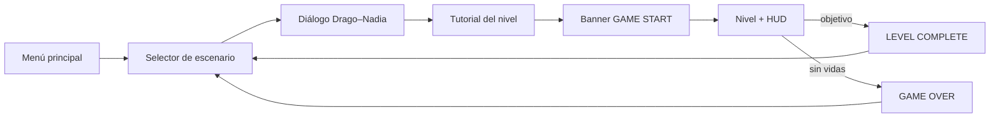

# GAME DESIGN DOCUMENT — KILLING TIME

**Versión 1.0**

Plataformas-shooter 2D de un jugador a través de cuatro épocas históricas

**INTEGRANTES**

- Erick Mideros
- Martin Posso
- Kevin Villacis
- Santos Villarreal

Materia: Desarrollo de Juegos Interactivos | Motor: Phaser 3.90 | 2026

---

## 01 / VISIÓN — Resumen ejecutivo

**Killing Time** es un plataformas-shooter 2D de un solo jugador. Drago, un soldado
enviado a través de portales temporales, recupera las gemas de protección que
sostenían cuatro épocas históricas antes de que el coronel Viktor Kaelen las
fracture con el dispositivo KT.

Cada uno de los cuatro escenarios está diseñado para una sesión de 6 a 8 minutos y
plantea una **presión distinta**: no cambia solo el decorado, cambia qué te mata y
cómo se administra el riesgo.

### Propuesta de valor

- **Una mecánica de riesgo por época**: cada nivel enseña un sistema nuevo en lugar de repetir el mismo con otra piel.
- **Dificultad expresada en vidas**: 3, 1, 5 y 3 vidas comunican de entrada el tipo de tensión de cada escenario.
- **Identidad histórica**: Roma, Egipto, Japón feudal y una fortaleza medieval, con arte pixel art de 16 bits.
- **Trazabilidad académica**: constantes de balance centralizadas y verificaciones documentadas de cada mecánica.

> **Público objetivo:** estudiantes y jugadores casuales familiarizados con el
> plataformas de acción clásico (estilo Metal Slug), en teclado de escritorio.

### Pilares de diseño

| Pilar | Aplicación |
|---|---|
| Cada época, un peligro | El nivel 2 mata por tiempo, el 3 por acumulación, el 4 por geometría. |
| Peligro anunciado | El verdugo avisa antes de embestir, las plataformas de aire brillan antes de lanzar, las losas falsas parpadean antes de ceder. |
| Aritmética antes que intuición | Toda travesía se comprueba contra el alcance real del salto antes de darla por jugable. |

---

## 02 / NARRATIVA — Historia y mundo

Tras décadas de equilibrio, cuatro **gemas de protección** sostienen los puntos de
anclaje de la línea temporal: una por época. El coronel **Viktor Kaelen** activa el
dispositivo **KT** y las fractura, sembrando cada era de enemigos corrompidos por
esquirlas de gema y de máquinas que no deberían existir allí.

**Drago**, soldado checheno, es enviado por los portales para recuperar los
artefactos de cada época. **Nadia**, analista temporal, le guía por radio y le
fabrica el equipo especial que cada era exige.

### Conflicto principal

Kaelen no aparece en ninguno de los cuatro escenarios: aparece su obra. La
fortaleza medieval del cuarto nivel **no está en ningún registro histórico** — la
construyó él. Recuperar el artefacto que hay tras su portón es lo que cierra la
línea temporal.

### Estructura dramática

| Acto | Momento jugable | Resultado narrativo |
|---|---|---|
| I — La fractura | Nivel 1: Coliseo de Roma | Se recomponen los tres fragmentos de la primera gema. |
| II — El sello | Nivel 2: desierto de Egipto | Se libera el artefacto que protege la ciudad. |
| III — La torre | Nivel 3: torre del shōgun | Se recupera el tesoro sellado de la era. |
| IV — La línea rota | Nivel 4: fortaleza de Kaelen | El artefacto final cierra la línea temporal. |

> **Tono:** militar y sobrio. Nadia informa, no dramatiza; Drago responde con
> frases cortas. La tecnología temporal es peligrosa, no mágica.

---

## 03 / PERSONAJES — Héroe, aliada y antagonista

| Personaje | Descripción visual | Función |
|---|---|---|
| **Drago** (jugador) | Soldado checheno, uniforme verde oliva, chaleco táctico, rifle de asalto. | Único personaje jugable en los cuatro niveles. |
| **Nadia** | Analista temporal; equipo militar mezclado con brazaletes de runas y un amuleto de gema. | Voz de radio: contexto, objetivos y explicación de cada habilidad. |
| **Viktor Kaelen** | Coronel de uniforme oscuro con insignias de tecnología temporal. | Antagonista. Presente en el retrato de los diálogos, nunca como jefe jugable. |

### Principios de lectura visual

- Drago mantiene la **misma silueta y controles** en los cuatro niveles: lo que cambia es el entorno y la habilidad concedida.
- Los enemigos se distinguen por época, pero **todos mueren a 3 impactos**, así que el jugador nunca duda de cuánto aguanta un enemigo.
- Cada enemigo lleva **barra de vida flotante** (verde → naranja → rojo) dibujada por código, sin depender de assets.
- Los estados que importan se anuncian con **color y forma**: rojo y vibración antes de una embestida, gris parpadeante durante un aturdimiento, tinte cian durante el dash.

### Enemigos

Todos comparten 3 puntos de vida y son **inmunes a las trampas del escenario**: los
pinchos, el ácido y las hachas solo afectan a Drago.

| Enemigo | Nivel | Patrulla | Persecución | Detección | Conducta distintiva |
|---|---|---|---|---|---|
| **Soldado romano** | 1 | 90 px/s | 250 px/s | 150 px | Carga con la lanza al detectar; ataque cada 900 ms. |
| **Momia** | 2 | 150 px/s | 150 px/s | 260 px | **No se queda muerta**: cae 3 s y se levanta con la vida completa. |
| **Ninja** | 3 | 120 px/s | 200 px/s | 340 px | Lanza shuriken de lejos (cada 1,8 s); wakizashi por debajo de 60 px. |
| **Verdugo** | 4 | 70 px/s | 300 px/s (embestida) | 220 px | Avisa 500 ms, embiste en línea recta y queda **aturdido 1 s** al chocar. |

---

## 04 / MECÁNICAS — Reglas del juego

### Bucle principal

Avanzar → leer el peligro anunciado → disparar o esquivar → resolver la mecánica
propia del nivel → recoger el objetivo → completar el escenario.

### Sistemas comunes a los cuatro niveles

| Sistema | Regla |
|---|---|
| Movimiento | 200 px/s en horizontal. Gravedad global 800 px/s². |
| Salto | 3 tiles de altura (192 px), solo con los pies en el suelo. |
| Disparo | Proyectil frontal a 700 px/s; cadencia máxima de 200 ms. |
| Munición | Cargador de 7 balas, recarga automática de 1,2 s, recargas infinitas. |
| Apuntado | W dispara hacia arriba; S hacia abajo en el aire; si no, hacia donde mira. |
| Daño | Un impacto cuesta una vida, con 800 ms de invulnerabilidad y parpadeo. |
| Reaparición | Al perder una vida se vuelve al inicio del mapa; **lo ya recogido sigue recogido**. |
| Victoria | Completar el objetivo del nivel; se guarda como superado. |
| Derrota | Agotar las vidas del nivel; vuelta al selector de escenario. |

### La aritmética del salto

Todas las alturas se derivan de la rejilla de 64 px con `jumpVelocityForTiles(n)`,
que traduce "quiero saltar N bloques" a la velocidad necesaria (`v = √(2·g·h)`).
Estos son los límites reales que condicionan **todo** el diseño de niveles:

| Impulso | Altura | Velocidad | Alcance horizontal |
|---|---|---|---|
| Salto normal | 192 px (3 tiles) | −554 | 277 px (4,3 tiles) |
| Doble salto (nivel 2) | +192 px encadenados | −554 | — |
| Trampolín (nivel 3) | 448 px (7 tiles) | −847 | — |
| Impulso de aire (nivel 4) | 384 px (6 tiles) | −784 | — |

> **Regla de diseño derivada:** sin plataforma auxiliar, ningún hueco puede pasar de
> **3 tiles (192 px)**. Uno de 4 tiles deja 21 px de margen —inservible en la
> práctica— y uno de 5 tiles es matemáticamente imposible.

### Habilidades por época

| Habilidad | Nivel | Parámetros |
|---|---|---|
| **Doble salto** | 2 | Segunda pulsación de ESPACIO en el aire. Enfriamiento de 5 s. |
| **Dash** | 3 | 600 px/s durante 200 ms, **invulnerable mientras dura**. Enfriamiento de 5 s. |

### Pausa

ESC congela físicas y temporizadores del nivel (oleadas, rocas y enfriamientos
incluidos) y muestra una capa de pausa. Desde ahí, M vuelve al selector.

---

## 05 / INTERFAZ — Controles y HUD

### Controles

| Acción | Tecla | Alternativa |
|---|---|---|
| Mover | A / D | ← / → |
| Apuntar arriba / abajo | W / S | ↑ / ↓ |
| Saltar (y doble salto) | ESPACIO | — |
| Disparar | J | — |
| Interactuar (palanca, vendaje) | E | — |
| Dash | SHIFT | — |
| Pausa | ESC | — |
| Volver al selector (en pausa) | M | — |

El juego se completa **sin ratón**. Los menús aceptan teclado y puntero.

### HUD configurable por nivel

El HUD corre como **escena paralela** al nivel, de modo que no le afecta el
desplazamiento ni la pausa de físicas. Cada nivel declara qué widgets monta:

| Nivel | Widgets |
|---|---|
| 1 — Roma | Munición, vidas, contador de fragmentos |
| 2 — Egipto | Munición, temporizador, **barra de escudo térmico**, doble salto, **brújula** |
| 3 — Japón | Munición, vidas, dash, **estado de sangrado**, vendajes |
| 4 — Medieval | Munición, vidas, contador de llaves |

El nivel 2 **sustituye las vidas por la barra de escudo**: con una sola vida, un
contador de vidas no aporta información, y el escudo sí es lo que va a matarte.

### Criterios UX

| Criterio | Solución |
|---|---|
| Lectura en acción | Iconos con texto redundante; el color nunca es el único canal. |
| Aprendizaje | Panel de tutorial por nivel antes de jugar, con las teclas implicadas. |
| Peligro justo | Todo golpe fuerte tiene aviso previo visible. |
| Orientación | Brújula al borde de la pantalla cuando el objetivo del nivel 2 queda fuera de cámara. |
| Recuperación | Pausa reversible; el progreso recogido sobrevive a perder una vida. |

### Flujo de escenas



Cada eslabón se salta solo si su escena no existe, de modo que el flujo funcionaba
ya con el proyecto a medio construir.

---

## 06 / OBJETOS — Recursos y amenazas

### Objetivos y consumibles

| Elemento | Nivel | Efecto |
|---|---|---|
| Fragmento de gema | 1 | Objetivo: 3 fragmentos completan el nivel. |
| Talismán solar | 2 | Reinicia el escudo térmico a 15 s y **reaparece en otro punto válido**. |
| Artefacto de la ciudad | 2 | Objetivo: se libera al cumplirse el minuto de supervivencia. |
| Vendaje | 3 | Detiene el sangrado (1 unidad) o se canjea por una vida (2 unidades). |
| Tesoro del shōgun | 3 | Objetivo: está en la cima de la torre. |
| Llave del rey | 4 | 3 llaves abren el portón final. |
| Artefacto temporal | 4 | Objetivo final: cierra la línea temporal. |

### Trampas por época

| Trampa | Nivel | Comportamiento |
|---|---|---|
| Pinchos | 1 | Al fondo de los acantilados. Cuestan una vida. |
| Suelo falso | 1 | Cede **1 s** después de pisarlo, parpadeando. Si te apartas antes, se recompone. |
| Plataforma móvil | 1 | Recorrido por tween: 200 px / 3 s en horizontal, 150 px / 2,5 s en vertical. |
| Arena movediza | 2 | Reduce la velocidad a la mitad. Pararse 2 s dentro te atrapa: **10 pulsaciones de salto en 3 s** para salir. |
| Roca rodante | 2 | Baja de las colinas cada 3-5 s a 260 px/s. Un toque acaba el nivel. |
| Trampa de shuriken | 3 | Panel de pared que dispara cada 2-3 s con trayectoria fija. |
| Trampolín | 3 | Impulsa 7 tiles al caer sobre él. |
| Foso de ácido | 4 | Cubre todo el fondo del mapa: la fortaleza es un conjunto de islas. |
| Hacha péndulo | 4 | Oscila ±45° cada 1,5 s. **Solo el filo hace daño**, no la cadena. |
| Palanca A/B | 4 | Intercambia dos grupos de plataformas: el puente hacia delante y la escalera a la tercera llave. |
| Plataforma de aire | 4 | Lanza 6 tiles cada 3 s, con **600 ms de aviso luminoso**. |

### El sistema de sangrado (nivel 3)

Los shuriken **no quitan vida**: provocan un sangrado que mata en 5 s si no te
vendas. Es el sistema con más casuística del juego, y sus siete reglas viven
aisladas en un solo módulo para poder auditarlas:

| # | Situación | Consecuencia |
|---|---|---|
| R1 | Shuriken sin sangrar | Empieza el sangrado. No cuesta vida. |
| R2 | Shuriken **ya sangrando** | Cuesta 1 vida y el sangrado continúa… salvo que te deje en 1 vida, entonces se corta. |
| R3 | Se agotan los 5 s | Cuesta 1 vida y el sangrado se corta. |
| R4 | Cuerpo a cuerpo **sangrando** | Te deja en 1 vida, vengas de las que vengas, y corta el sangrado. |
| R5 | Cuerpo a cuerpo sin sangrar | Cuesta 1 vida. |
| R6 | E sangrando, con vendajes | Gasta 1 vendaje y corta el sangrado. |
| R7 | Doble E sin sangrar | Gasta 2 vendajes y recupera 1 vida (máximo 5). |

Se empieza con 2 vendajes y hay 3 más repartidos por el mapa.

---

## 07 / NIVELES — Diseño de escenarios

Los cuatro mapas se declaran por **(columna, fila)** sobre una rejilla de 64 px al
principio de cada escena, de modo que mover un pozo o una repisa es editar un array.

| Nivel | Dimensiones | Vidas | Enemigo | Presión dominante |
|---|---|---|---|---|
| 1 — Antigua Roma | 4032 × 640 px | 3 | Soldado romano | Geometría: plataformas y trampas de suelo |
| 2 — Antiguo Egipto | 3584 × 640 px | **1** | Momia | Tiempo: el escudo térmico |
| 3 — Japón Feudal | 3200 × **1408** px | 5 | Ninja | Acumulación: el sangrado |
| 4 — Fortaleza Medieval | 4032 × 768 px | 3 | Verdugo | Precisión: todo hueco es mortal |

### Nivel 1 — Antigua Roma · *El Coliseo fracturado*

Recorrido lineal de tres secciones separadas por acantilados con pinchos.

```
 A: patio y repisas          B: islas y suelo falso         C: tramo final
[========]  ~~~~~  [=====]  [FFF]  [=====]  ~~~  [==============]
 0-14      15-19    20-27   28-30   31-37  38-40      41-62
            ↑                 ↑              ↑
     plataforma móvil    losas falsas    salto de 3 tiles
     (5 tiles: obligatoria)
```

El **primer acantilado mide 5 tiles**: es imposible de saltar y obliga a usar la
plataforma móvil. El segundo mide 3 y se cruza de un salto con 85 px de margen. Los
tres fragmentos están tras la plataforma horizontal, en una repisa que solo se
alcanza con la plataforma vertical, y al final custodiados por dos legionarios.

### Nivel 2 — Antiguo Egipto · *El sello del sol*

Arena abierta con suelo continuo: aquí no se cae, se muere de calor.

```
 [meseta]\__  valle  __/[plataformas]\__  valle  __/[meseta]
  0-6  7-8   14-18 arena   20-24 / 26-29 / 31-35   36-40   47-55
   ↑                              ↑                          ↑
 rocas ruedan            centro elevado              rocas ruedan
```

Dos fases: **60 s de supervivencia** con oleadas de momias (máximo 4 activas, que
reviven a los 3 s) y rocas rodantes; después se libera el artefacto en el centro y
las momias se desvanecen. Por encima de todo corre el escudo térmico de 15 s con 2 s
de gracia.

### Nivel 3 — Japón Feudal · *La torre del shōgun*

El único nivel **vertical**: 1408 px de alto. Ascenso en zigzag, cada plataforma
128 px por encima de la anterior.

```
                                   [==== cima ====] ← tesoro
                            [P6]───┘  ↑ trampolín obligatorio
                     [P5]
              [P4]
       [P3]
  [P2]
[P1]
[============ patio ============]      (a partir de aquí, vacío)
```

Las cuatro trampas de pared barren las plataformas a la altura del pecho. El último
tramo son 4 filas de golpe: **solo se sube con trampolín**.

### Nivel 4 — Fortaleza Medieval · *La línea rota*

Islas sobre un foso de ácido continuo.

```
[== patio ==]  [isla] [isla]  [== palanca ==]  [antesala] [== galería ==]
  0-12          16-18  21-23      26-31          43-46        52-62
      ↑           ↑  ↑              ↑    ↑           ↑        ↑      ↑
   verdugo     hachas péndulo   grupo B  grupo A  impulso  portón artefacto
                                (escalera) (puente)  de aire
~~~~~~~~~~~~~~~~~~~~ ÁCIDO (todo el fondo) ~~~~~~~~~~~~~~~~~~~~
```

La palanca hay que accionarla **al menos dos veces**: el grupo A es el puente que
lleva hacia delante y el B la escalera a la tercera llave. La escalera sube hacia la
izquierda a propósito, para que al caerse de ella se aterrice en suelo firme y no en
el ácido.

### Curva de dificultad

| Nivel | Sistemas simultáneos | Qué se aprende |
|---|---|---|
| 1 | Movimiento, disparo, plataformas | Los fundamentos y a desconfiar del suelo. |
| 2 | + gestión de tiempo, doble salto, oleadas | Administrar un recurso que se agota mientras te persiguen. |
| 3 | + dash, sangrado, verticalidad | Que el daño puede ser diferido y curable. |
| 4 | + geometría mortal, estados del escenario | Combinar todo con precisión, sin margen de error. |

---

## 08 / ARTE Y AUDIO — Dirección audiovisual

### Lenguaje visual

| Componente | Decisión |
|---|---|
| Estilo | Pixel art de 16 bits, referencia Metal Slug: colores saturados, contornos negros y sombreado de contraste duro. |
| Personajes | Hojas de 6 frames a 128×128 px, con estados *idle*, *walk* y *attack*. |
| Fondos | Parallax de 3 capas por época (1920×540) con factores de scroll 0,2 / 0,5 / 0,9. |
| Terreno | Texturas tileables de 64×64 px, una por época. |
| Feedback | Tinte y parpadeo para estados (aviso, aturdimiento, invulnerabilidad, sangrado); destellos de cámara en los momentos clave. |

La capa **cercana** del parallax se dibuja **delante del jugador** como decoración
de primer plano, y el motor la descarta automáticamente si detecta que es opaca (ver
sección 11).

### Audio

19 pistas en MP3: 10 de música (una por escena y por nivel), 3 jingles de evento y
6 efectos.

| Grupo | Pistas |
|---|---|
| Música | carga, menú, selector, diálogo, tutorial, cómic, y una por cada nivel |
| Jingles | GAME START, LEVEL COMPLETE, GAME OVER |
| Efectos | disparo, recarga, salto, daño, recolección, muerte de enemigo |

Decisiones que definen el sistema:

- **La música no se corta entre escenas, se sustituye** con fundido: no hay silencios en la cadena menú → diálogo → tutorial → nivel.
- **Una pista que falte no es un error**: se ignora en silencio, igual que con los placeholders gráficos.
- Los fundidos van sobre `requestAnimationFrame` y **no sobre tweens de escena**, por el motivo explicado en la sección 11.

---

## 09 / TÉCNICA — Arquitectura

| Capa | Tecnología | Responsabilidad |
|---|---|---|
| Motor | Phaser 3.90 (CDN) | Arcade Physics, escenas, grupos, colisiones, tweens y audio. |
| Código | JavaScript con módulos ES | 45 módulos, una clase por archivo, sin bundler. |
| Ejecución | Servidor HTTP estático | Los módulos ES exigen HTTP; no hay build ni `npm install`. |
| Persistencia | `localStorage` | Niveles superados y ajustes de audio. |

### Organización

```
src/
  config/    Constantes de balance, fichas de nivel, manifiestos, guiones
  scenes/    Boot, Preload, menús, diálogo, tutorial, banner, HUD, 4 niveles
  entities/  Jugador, bala, base de enemigos + 4 enemigos, 6 trampas
  systems/   Input, vidas, munición, cooldowns, sangrado, audio, guardado
```

### Decisiones de arquitectura

**`BaseLevelScene` como esqueleto.** Concentra parallax, jugador, balas, cámara,
HUD, pausa, reaparición, banners y fin de nivel. Una `LevelXScene` solo implementa
seis ganchos: `buildTerrain()`, `buildLevel()`, `updateLevel()`, `resetEnemies()`,
`getSpawnPoint()` y `getHudState()`. Sin esto, cada cambio transversal habría que
replicarlo cuatro veces.

**Toda la dificultad en un archivo.** `GameConfig.js` contiene cada velocidad,
enfriamiento y temporizador del juego. Ajustar el balance no requiere abrir ninguna
escena.

**Manifiesto de assets con placeholders procedurales.** Los 78 assets declaran su
ruta, dimensiones y número de frames. Si un archivo no existe, se genera por código
una textura con la misma clave y dimensiones. El juego fue jugable de principio a
fin **antes de tener una sola imagen**, y sustituir un placeholder por el asset
definitivo es copiar el archivo: cero cambios de código.

**El estado se reinicia en `init()`, no en el constructor.** Phaser reutiliza las
instancias de escena entre partidas, así que el constructor solo corre una vez por
sesión.

### Robustez

- El **debug de físicas nunca está activo por defecto**: solo con `?debug=1`.
- La carga tiene un **detector de atasco**: si pasan 12 s sin ningún avance, el juego arranca sin lo que falte en lugar de dejar al jugador en la pantalla de carga.
- Las balas y proyectiles se **reciclan en pools**; los enemigos se desactivan y reactivan en vez de destruirse.

### Atajos de desarrollo

| Querystring | Efecto |
|---|---|
| `?debug=1` | Dibuja las cajas de colisión |
| `?scene=Level3Scene&level=3` | Arranca en una escena concreta |
| `?skipIntro=1` | Entra al nivel sin el banner |
| `?zoom=0.235` | Aleja la cámara para revisar el trazado completo de un mapa |

### Compatibilidad

Navegadores de escritorio modernos con WebGL o Canvas y teclado. Resolución interna
fija de 960×540 escalada con `Phaser.Scale.FIT`.

---

## 10 / VERIFICACIÓN — Hallazgos y correcciones

> **Nota:** los hallazgos de esta bitácora son los detectados realmente durante el
> desarrollo. Las **fechas y duraciones son una plantilla**: hay que ajustarlas a
> las sesiones efectivas de cada integrante antes de la entrega.

### Protocolo aplicado

Cada integrante completa tres corridas consecutivas y registra el hallazgo que más
le estorbó. Sobre esa bitácora se aplicaron tres métodos de comprobación según lo
que hubiera que validar:

1. **Comprobación aritmética previa.** Antes de dar por jugable un nivel se verifica cada travesía contra el alcance real del salto (192 px de alto, 277 px de largo) con un script que imprime el margen de cada uno.
2. **Pruebas unitarias de lógica.** Los sistemas que no dependen de Phaser (sangrado, munición, audio) se prueban aislados con objetos simulados.
3. **Renderizado y medición.** Capturas del juego en ejecución para la maquetación, y decodificación directa de los PNG para medir dimensiones y transparencia.

### Bitácora de sesiones

| Integrante | Corrida | Duración | Progreso | Hallazgo principal | Mejora resultante |
|---|---|---|---|---|---|
| Kevin Villacis | 1 | 8 min | Nivel 1, sección A | El juego se congelaba por completo al disparar a un legionario. | `pairBy()`: orden de argumentos de colisión resuelto por tipo. |
| Kevin Villacis | 2 | 11 min | Nivel 1 completo | Los enemigos caminaban mirando al lado contrario al que avanzaban. | `faceDirection()` corregido tras comprobar las hojas de sprites. |
| Kevin Villacis | 3 | 9 min | Nivel 3 completo | Los shuriken se leían mal: no estaba claro que el daño fuera diferido. | Panel de tutorial específico del sangrado antes del nivel. |
| Erick Mideros | 1 | 12 min | Nivel 1, sección B | El segundo acantilado era imposible de saltar; no había forma de pasar. | Hueco reducido de 5 a 3 tiles, con 85 px de margen. |
| Erick Mideros | 2 | 10 min | Nivel 1 completo | La repisa del segundo fragmento no se alcanzaba ni con la plataforma. | Repisa bajada a 5 tiles y plataforma desplazada a un lado. |
| Erick Mideros | 3 | 13 min | Nivel 4 completo | Las hachas péndulo hacían daño donde no se veía el filo. | Hitbox del filo como `Zone` centrado y trigonometría corregida. |
| Santos Villarreal | 1 | 9 min | Nivel 2, fase 1 | El talismán del escudo aparecía bajo las mesetas, inalcanzable; muerte por calor sin opción. | `isOpenToSky()` y tope de distancia de reaparición. |
| Santos Villarreal | 2 | 14 min | Nivel 2 completo | Tras varias transiciones sonaban varias músicas encimadas. | Fundidos de audio independientes de la escena y barrido de pistas sueltas. |
| Santos Villarreal | 3 | 11 min | Nivel 4 completo | Los personajes flotaban unos píxeles sobre el suelo con el arte final. | Cajas de colisión recalibradas midiendo el alpha de cada hoja. |
| Martin Posso | 1 | 10 min | Nivel 2, fase 1 | Una sola vida con 60 s de supervivencia se percibió al límite de lo justo. | Constantes de balance centralizadas para ajustarlo sin tocar lógica. |
| Martin Posso | 2 | 8 min | Nivel 3, plataforma 4 | El nivel 1 se veía plano: el fondo no daba sensación de profundidad. | Parallax de tres capas, con la cercana delante del jugador. |
| Martin Posso | 3 | 12 min | Nivel 4 completo | El jingle de inicio seguía sonando sobre la música del nivel. | Corte del jingle con fundido al terminar el banner. |

### Resultado del consenso

- **Prioridad absoluta a lo que rompe la partida**: la congelación al disparar y las travesías imposibles se corrigieron antes que cualquier ajuste estético.
- **Comprobar la geometría con números, no jugando**: dos de los tres bloqueos del nivel 1 eran aritméticamente imposibles y se habrían detectado antes con el script de márgenes.
- **Anticipar todo golpe fuerte**: avisos previos en el verdugo, las plataformas de aire y las losas falsas.
- **Aislar la casuística compleja**: las siete reglas de sangrado en un módulo propio y con pruebas.
- **Que un error de assets no rompa el juego**: guardias que validan dimensiones y descartan capas de primer plano opacas.

> Las nueve mejoras de la matriz siguiente responden directamente a estos hallazgos
> y están activas en la versión final.

### Hallazgo prioritario 1 — Congelación al dañar a un enemigo

_Detectado por Kevin Villacis (corrida 1)._

| Campo | Registro |
|---|---|
| **Síntoma** | Al disparar a un enemigo el juego se detenía por completo; la bala quedaba inmóvil junto a él y su barra de vida intacta. |
| **Causa** | Phaser **invierte el orden de los argumentos** del callback de colisión cuando se mezcla un grupo con un array. Con `overlap(grupoDeBalas, arrayDeEnemigos)` resuelve por `collideSpriteVsGroup` e invoca `cb(enemigo, bala)`. El `bullet.deactivate()` caía sobre un enemigo → `TypeError` → se rompía el bucle de render. |
| **Diagnóstico** | Prueba aislada que llamaba a `takeBulletHit()` directamente (funcionaba) y después por la vía real del `overlap` (fallaba), imprimiendo el tipo de cada argumento recibido. |
| **Solución** | `pairBy(Tipo, a, b)` en `systems/CollisionUtils.js`: resuelve el par **por tipo y nunca por posición**. |
| **Alcance** | Había una segunda instancia del mismo error sin detectar (balas contra losas falsas), corregida a la vez. |

### Hallazgo prioritario 2 — Hitbox de las hachas péndulo

_Detectado por Erick Mideros (corrida 3)._

| Campo | Registro |
|---|---|
| **Síntoma** | Las hachas del nivel 4 hacían daño donde no se veía el filo. |
| **Causa A** | `body.setCircle(r)` sin offsets deja el círculo pegado a la esquina superior izquierda del cuerpo. Sobre un sprite de 80×160 eso situaba la zona de daño **54 px más arriba**, en mitad de la cadena. |
| **Causa B** | El signo de X de la trigonometría estaba invertido: el hitbox quedaba **reflejado** respecto al arco visible. |
| **Diagnóstico** | El primer test dio "desfase 0 px" porque comparaba la fórmula **contra sí misma**, y a 0° el seno vale 0. Contrastarla contra `getWorldTransformMatrix()` de Phaser destapó los 182 px de error. |
| **Solución** | Hitbox como `Zone` del tamaño exacto del círculo (offset centrado por defecto) y signo corregido. Distancia y radio derivados de **medir el alpha del arte**: el filo está en y=136 de 160. |
| **Resultado** | Desfase de 0,00 px en los 9 ángulos del arco, en ambas hachas. |

### Hallazgo prioritario 3 — Pistas de audio solapándose

_Detectado por Santos Villarreal (corrida 2)._

| Campo | Registro |
|---|---|
| **Síntoma** | Tras varias transiciones sonaban varias músicas a la vez y no se entendía nada. |
| **Causa** | Los fundidos usaban `scene.tweens`, pero los sonidos de Phaser son **globales**. Al terminar una escena, Phaser destruye sus tweens, así que el `onComplete` que paraba la pista anterior no se ejecutaba nunca. Una pista huérfana por transición. El peor caso era el jingle de GAME START (más de 30 s), cuyo fundido se lanzaba una línea antes de `scene.stop()`. |
| **Solución** | Fundidos sobre `requestAnimationFrame`, independientes de las escenas, más un barrido de seguridad que corta cualquier pista suelta al poner música nueva. |
| **Verificación** | 20 comprobaciones con sonidos simulados: encadenando las cinco escenas queda exactamente una pista viva en cada paso. |

### Resto de hallazgos

| # | Hallazgo | Causa | Corrección |
|---|---|---|---|
| 4 | Hueco imposible de saltar en el nivel 1 | 5 tiles = 320 px contra 277 px de alcance real | Reducido a 3 tiles (85 px de margen) |
| 5 | Repisa del segundo fragmento inalcanzable | A 6 tiles del suelo **y con la plataforma vertical justo debajo**: el salto chocaba con su cara inferior | Repisa a 5 tiles y plataforma desplazada al lado |
| 6 | Talismán del escudo inalcanzable | Aparecía en el suelo enterrado bajo las mesetas —una cavidad sellada— y se moría de calor sin poder llegar | `isOpenToSky()` descarta superficies tapadas, y un tope de distancia evita que aparezca al otro extremo del mapa |
| 7 | Sprites de enemigos volteados | El documento de arte decía que miraban a la izquierda; los archivos entregados miran a la derecha | `faceDirection()` invertido tras comprobar las hojas |
| 8 | Cajas de colisión descuadradas con el arte final | Estaban calibradas para placeholders que rellenaban el frame; los sprites reales traen margen transparente | Alturas recalibradas **midiendo el alpha** de cada hoja |
| 9 | Carga colgada sin dispositivo de audio | `decodeAudioData` no resuelve ni rechaza nunca, el loader no termina | Detector de atasco de 12 s (con `window.setTimeout`, porque el reloj de la escena no avanza durante la carga) |
| 10 | Capa de primer plano opaca | `level1_near` se entregó sin transparencia; al ir delante del jugador tapaba el nivel entero | `isUsableForeground()` muestrea píxeles y descarta cualquier capa de primer plano opaca |

---

## 11 / MEJORAS — Matriz de asignación

| # | Responsable | Problema base | Solución implementada | Evidencia en código |
|---|---|---|---|---|
| 1 | Erick Mideros | Repetir pausa, HUD y respawn en cada nivel | `BaseLevelScene` con seis ganchos | `scenes/BaseLevelScene.js` |
| 2 | Kevin Villacis | Balance repartido por el código | Todas las constantes en un archivo | `config/GameConfig.js` |
| 3 | Erick Mideros | Alturas de salto a ojo | `jumpVelocityForTiles(n)` deriva los impulsos de la rejilla | `config/GameConfig.js` |
| 4 | Santos Villarreal | Depender de tener el arte para programar | Manifiesto + placeholders procedurales | `systems/PlaceholderFactory.js` |
| 5 | Kevin Villacis | Casuística de sangrado dispersa | Las 7 reglas aisladas y probadas | `systems/BleedingSystem.js` |
| 6 | Martin Posso | Orden de argumentos de colisión no fiable | `pairBy()` resuelve por tipo | `systems/CollisionUtils.js` |
| 7 | Erick Mideros | Música cortada entre escenas | Sustitución con fundido independiente de escena | `systems/AudioManager.js` |
| 8 | Martin Posso | Errores de exportación de assets rompen el juego | Guardias que descartan capas opacas y validan dimensiones | `scenes/BaseLevelScene.js`, `PreloadScene.js` |
| 9 | Santos Villarreal | Peligro sin anticipación | Avisos previos en verdugo, plataformas de aire y suelo falso | `entities/Executioner.js`, `AirPlatform.js`, `FakeFloor.js` |

### Estado de los assets

| Categoría | Estado |
|---|---|
| Gráficos | **71 de 78** integrados, todos con dimensiones exactas verificadas |
| Audio | **19 de 19** integrados y verificados como archivos distintos |
| Ausentes | `nadia_idle`, `muzzle_flash` e `intro_panel_1..5` — **ninguno lo usa el código** |
| Con reserva | `level1_near` está entregada pero es opaca: el motor la descarta hasta que se reexporte con transparencia |

### Pendiente

- Ajustar fechas y duraciones de la bitácora a las sesiones efectivas de cada integrante.
- Ajustar el balance con esos datos: en particular si el nivel 2 (una sola vida y 60 s de supervivencia) resulta jugable o excesivo.
- Reexportar `level1_near.png` con transparencia para recuperar el parallax de tres capas en el nivel 1.
- Opcional: `IntroComicScene` con los cinco paneles de la historieta de apertura.

---

## Cómo ejecutar el proyecto

El juego usa **módulos ES**, que los navegadores bloquean al abrir el HTML con doble
clic. Hay que servirlo por HTTP desde la carpeta raíz:

```bash
npx serve             # o
python -m http.server # o la extensión Live Server de VS Code
```

No hay `npm install` ni proceso de compilación: Phaser se carga desde CDN.
